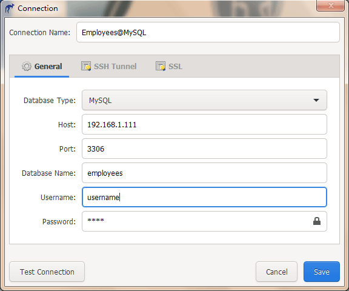
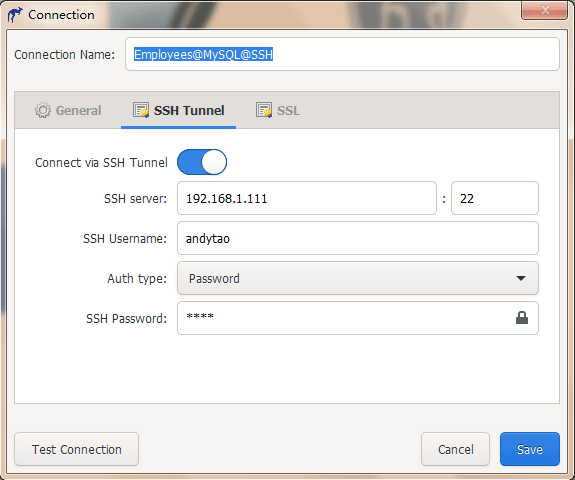

## Connection limitations
The connection have some limitations as follow:
- connection with SSL not yet support.
- connection with SSH with pass phrase not yet support

## SQLite
Make a SQLite connection is easy, just do as follow:
* step 1: click __New connection__ icon and name it
* step 2: click left icon to create an new database, then click __Test connection__ to test it
* step 3: click right icon to load an exist database, then click __Test connection__ to test it
* step 4: make sure you have done these steps, then click __Save__ icon to save it.
* step 5: open your new connection to perform operations.

## MySQL / MariaDB
MySQL / PostgreSQL connnection is more complicate, because it support multi authentication methods, so you should prepare material before making connection, the best way is choose mysql native password plugin(mysql_native_password), just follow the guide:
```sql
1) Open terminal
2) mysql -u root -p
3) Enter your password
4) ALTER USER root@localhost IDENTIFIED WITH mysql_native_password BY 'password';
```
After that, you could make a connection easily:


__Follow the label and tooltip__, fill the data as right place, then test connection. Every thing will be ok if the data is valid.



Your connection could through the private network over SSH(and over proxy), the built-in SSH client could help you done it.


## PostgreSQL
Just refer MySQL connection setting.