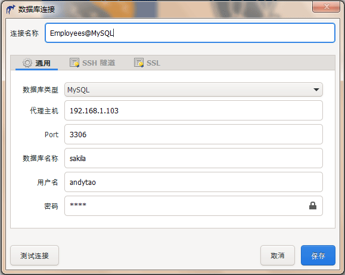
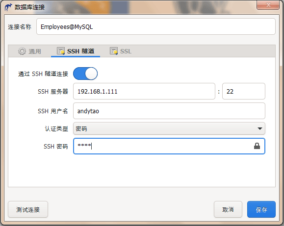

# 连接管理

## 数据库连接限制
目前版本的数据库连接具有如下限制：
- 安全套接字连接(SSL) 暂未支持
- 安全外壳协议连接(SSH) 暂不支持加密密匙

## SQLite
连接 SQLite 数据库是很容易的，只需按照如下步骤操作：
* 第一步: 点击标题栏上加号(+)按钮或者主菜单的__连接数据库__
* 第二步: 在连接起始页中选择__新建连接__，打开连接对话框。
* 第三步: 输入连接名字、选择数据库类型为 SQLite，然后选择左边加号创建或右边打开图标加载数据库文件。
* 第四步: 点击__测试连接__按钮测试连接可用性，然后点击__保存__按钮保存连接。
* 第五步: 连接起始页中选择点击新建的数据库连接，即可打开数据库。

## MySQL / MariaDB
MySQL / MariaDB 数据库连接类似于SQLite数据库连接，稍微复杂一些，因为它支持多种登录认证方式。所以您需要提前准备好连接所需相关素材,最顺畅的连接方式是使用原生密码认证登录方式(mysql_native_password), 原生密码认证登录方式可按如下步骤设置：
```sql
1) 打开控制台终端，执行命令
2) mysql -u root -p
3) 输入密码
4) ALTER USER root@localhost IDENTIFIED WITH mysql_native_password BY 'password';
```
更新登录认证方式后，连接数据库就很容易了，请参考下图:


如果您的数据库系统架设在私有网络或防火墙后面，集成 SSH2 客户端可帮助您轻松建立连接，请参考下图：




## PostgreSQL
PostgreSQL 数据库连接和MySQL数据库连接的差异性很少，参考 MySQL 连接即可；

<Vssue :issue-id="7" :title="$title" />
